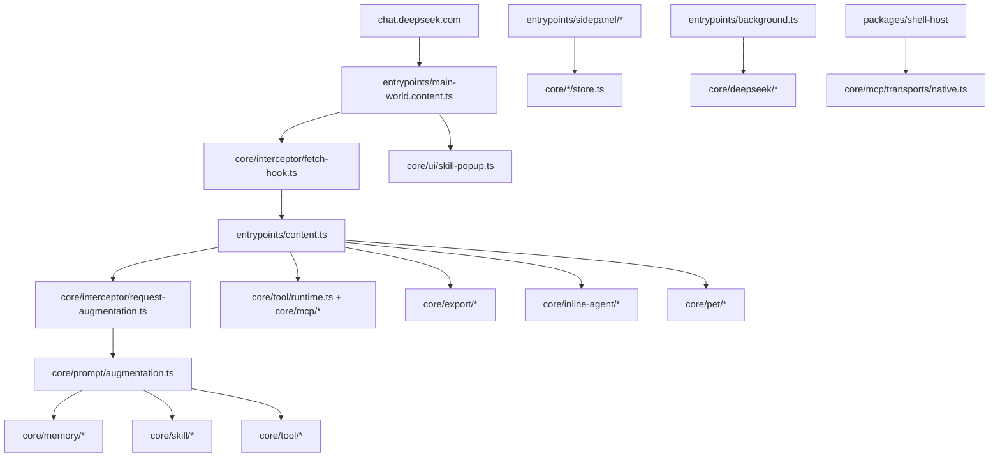

# Project Overview

## Preliminary Direction

把 EdgeTypE/better-deepseek 中 DeepSeek++ 当前缺失且高价值的能力纳入本项目，优先覆盖 Android WebView 平台、项目/文件上下文、生成物交付、沙箱代码执行、语音和会话组织；实现时保留 DeepSeek++ 现有 WXT + React + TypeScript + ToolDescriptor/MCP 架构，不照搬 Better DeepSeek 的独立 BDS 标签体系。

参照仓库快照：`EdgeTypE/better-deepseek` `450168e`，2026-06-09，`visualizer-kit css rework`。

## Current Architecture

DeepSeek++ 目前是浏览器扩展优先的架构：MAIN world 负责拦截 DeepSeek 请求和响应，content world 负责状态、DOM 渲染和工具执行，sidepanel 负责管理 UI，core 目录承载可测试的业务模块。现有能力已经覆盖 Chrome/Edge/Firefox、MCP、Shell Native Host、OfficeCLI skill、记忆、Skill、GitHub Skill import、WebDAV 同步、联网搜索/网页获取、对话导出、自动化任务、内联 agent 续跑、悬浮宠物和中英文运行时。

## Technology Stack

| Layer | Current | Target for this work |
|:--|:--|:--|
| Language | TypeScript, React, browser DOM APIs | TypeScript remains primary; Android adds Kotlin shell only behind platform ports |
| Framework | WXT MV3 extension, React sidepanel, Tailwind | WXT for browser targets; Android WebView host as separate platform target |
| Build Tool | WXT, TypeScript, npm workspaces | Add Android web-bundle staging and Gradle wrapper only if Android phase is accepted |
| Package Manager | npm | npm |
| Storage | `chrome.storage.local`, IndexedDB/Dexie, WebDAV sync boundaries | Keep existing storage contracts; add schemas for project files, saved items, and Android bridge state |
| Tool Runtime | Local tools + MCP providers + native messaging shell host | Extend via ToolDescriptor-compatible local tools and sandbox adapters |
| Deployment | Chrome/Edge/Firefox zip/release assets | Add signed/debug APK pipeline after Android bridge stabilizes |

## Entry Points

- `entrypoints/main-world.content.ts`: MAIN world bridge, fetch hook install, request augmentation RPC, skill popup.
- `entrypoints/content.ts`: content script runtime, tool execution rendering, export UI injection, token speed, pet, inline agent trace restore.
- `entrypoints/background.ts`: background RPC, sidepanel bridge, DeepSeek official API, export and automation operations.
- `entrypoints/sidepanel/App.tsx`: sidepanel shell and pages for settings, memory, skills, tools, MCP, automation, chat, capabilities.
- `core/interceptor/*`: fetch/SSE/tool parsing and request augmentation boundary.
- `core/tool/*` and `core/mcp/*`: local + MCP tool descriptors, execution, transport abstractions.
- `core/export/*`: official DeepSeek conversation export normalization and artifact generation.
- `packages/shell-host/*`: native messaging host for shell/Python/OfficeCLI.

## Build & Run

- Development: `npm run dev`
- Compile: `npm run compile`
- Tests: `npm test`
- Browser builds: `npm run build:chrome`, `npm run build:edge`, `npm run build:firefox`, `npm run build:all`
- Release gates: `npm run ci:quality`, plus targeted smoke commands in `package.json`

Better DeepSeek comparison points:

- It uses a custom Vite/Svelte multi-entry build (`build.js`) for Chrome/Firefox/Android.
- Android uses `android/` Kotlin WebView host, WebViewAssetLoader, JavaScript bridge, Android file/folder pickers, downloads, cookie/theme handling, and Gradle tasks.
- It has Playwright e2e for browser and Android WebView simulator, plus Kotlin unit tests.

## Testing Baseline

DeepSeek++ has a strong TypeScript/Vitest baseline for request augmentation, memory, MCP transport, i18n, export, sync, shell policy, inline markdown/prompt, and token speed. Current gaps for this transformation:

- No Android build, bridge, or emulator test harness.
- No e2e browser suite exercising DeepSeek DOM injection end to end.
- No tests for project/file context ingestion, RAG retrieval, saved snippets, voice, sandboxed code execution, or generated file artifacts because those modules do not exist yet.
- Prompt/tool changes are protected by `prompt:freeze`; any new model-facing tool syntax must update freeze fixtures intentionally.

## Project Governance Baseline

- Shared instruction surface: `AGENTS.md`, auto-generated from Claude project memory. It should not be hand-edited for durable rules unless the sync source is also updated.
- Claude Code surface: no root `CLAUDE.md`; `.claude/settings.local.json` exists.
- Other platform surfaces: `.codex/skills/` exists, but no project-specific skill files were found.
- Memory surface: Codex native memory is the resolved durable memory surface. No repo-local fallback memory file is declared.
- Previous active spec artifacts for multilingual English runtime support were complete and have been archived under `docs/archives/multilingual-english-runtime-support/`.

## External Integrations

- DeepSeek web and official web API/session endpoints.
- Browser extension APIs: storage, alarms, context menus, sidePanel, native messaging, downloads.
- MCP transports: HTTP, SSE, Streamable HTTP, bridge/native messaging.
- Shell Native Host and OfficeCLI installer.
- WebDAV sync.
- Bing web search and web fetch host permissions.
- GitHub Skill import API.

## Detected Tracking Mode

`GITHUB_STANDARD`: `gh` CLI and repo/issues access are available, but GitHub Projects scope is unavailable. Planning can create milestones, labels, and issues; no project board will be created unless auth is refreshed with project scope.
