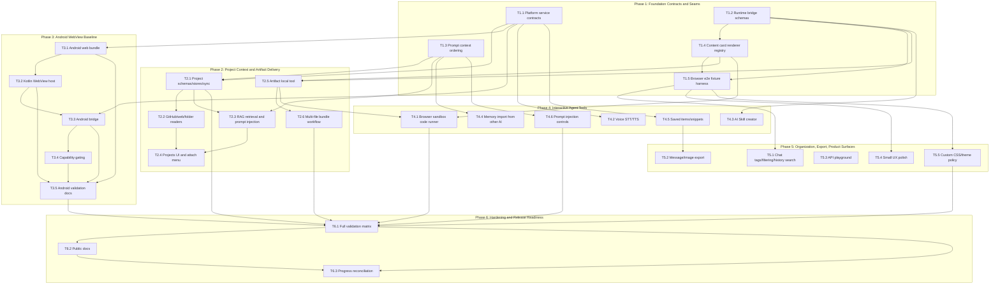

# Task Dependency Graph

```mermaid
graph TD
    subgraph P1["Phase 1: Foundation Contracts and Seams"]
        T1_1["T1.1 Platform service contracts"]
        T1_2["T1.2 Runtime bridge schemas"]
        T1_3["T1.3 Prompt context ordering"]
        T1_4["T1.4 Content card renderer registry"]
        T1_5["T1.5 Browser e2e fixture harness"]
        T1_2 --> T1_4
        T1_2 --> T1_5
        T1_4 --> T1_5
    end

    subgraph P2["Phase 2: Project Context and Artifact Delivery"]
        T2_1["T2.1 Project schemas/stores/sync"]
        T2_2["T2.2 GitHub/web/folder readers"]
        T2_3["T2.3 RAG retrieval and prompt injection"]
        T2_4["T2.4 Projects UI and attach menu"]
        T2_5["T2.5 Artifact local tool"]
        T2_6["T2.6 Multi-file bundle workflow"]
        T2_1 --> T2_2
        T2_1 --> T2_3
        T2_2 --> T2_4
        T2_3 --> T2_4
        T2_5 --> T2_6
    end

    subgraph P3["Phase 3: Android WebView Baseline"]
        T3_1["T3.1 Android web bundle"]
        T3_2["T3.2 Kotlin WebView host"]
        T3_3["T3.3 Android bridge"]
        T3_4["T3.4 Capability gating"]
        T3_5["T3.5 Android validation docs"]
        T3_1 --> T3_2
        T3_2 --> T3_3
        T3_3 --> T3_4
        T3_1 --> T3_5
        T3_2 --> T3_5
        T3_3 --> T3_5
        T3_4 --> T3_5
    end

    subgraph P4["Phase 4: Interactive Agent Tools"]
        T4_1["T4.1 Browser sandbox code runner"]
        T4_2["T4.2 Voice STT/TTS"]
        T4_3["T4.3 AI Skill creator"]
        T4_4["T4.4 Memory import from other AI"]
        T4_5["T4.5 Saved items/snippets"]
        T4_6["T4.6 Prompt injection controls"]
    end

    subgraph P5["Phase 5: Organization, Export, Product Surfaces"]
        T5_1["T5.1 Chat tags/filtering/history search"]
        T5_2["T5.2 Message/image export"]
        T5_3["T5.3 API playground"]
        T5_4["T5.4 Small UX polish"]
        T5_5["T5.5 Custom CSS/theme policy"]
        T4_5 --> T5_2
    end

    subgraph P6["Phase 6: Hardening and Release Readiness"]
        T6_1["T6.1 Full validation matrix"]
        T6_2["T6.2 Public docs"]
        T6_3["T6.3 Progress reconciliation"]
        T6_1 --> T6_2
        T6_1 --> T6_3
        T6_2 --> T6_3
    end

    T1_1 --> T2_1
    T1_3 --> T2_1
    T1_3 --> T2_3
    T1_2 --> T2_5
    T1_4 --> T2_5
    T1_1 --> T3_1
    T1_1 --> T3_3
    T1_2 --> T4_3
    T1_3 --> T4_4
    T1_3 --> T4_6
    T1_4 --> T4_1
    T1_1 --> T4_2
    T1_1 --> T4_5
    T2_5 --> T4_1
    T1_5 --> T5_1
    T1_5 --> T5_4
    T1_5 --> T5_5
    T2_1 --> T6_1
    T2_6 --> T6_1
    T3_5 --> T6_1
    T4_1 --> T6_1
    T4_6 --> T6_1
    T5_5 --> T6_1
```
